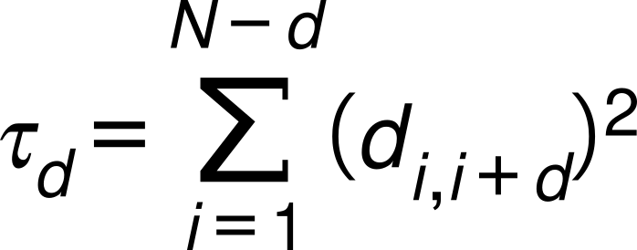

# AMPs

> Uso de machine learning para a predição das energias de afinidade entre 
> peptídeos antimicrobianos (WANG, LI, WANG, 2016) frente a Glicoproteína 
> Spike de Sars-Cov-2.

### Descritores

<div align="justify">
    <p> Baseado em teoria dos grafos (DANISHUDDIN, KHAN, 2016), 
        descritores moleculares topológicos foram implementados por meio 
        da biblioteca RDKit (https://pypi.org/project/rdkit-pypi/). 
        O descritores são: BalabanJ (BALABAN, 1982), Hall Kier Alpha 
        (HALL, KIER, 1991) e Kappa (HALL, KIER, 1991).<br/>
    </p>
    <p> Além destes descritores, foi implementado o descritor Sequence 
        Order Coupling Number (CHOU, 2000) acompanhado 
        das matrizes de distância entre os aminoácidos propostas 
        por Schneider e Wrede (SCHNEIDER, WREDE, 1994) e Grantham 
        (GRANTHAM, 1974).<br/>
    </p>
</div>

<div>
    <p>
        O número da ordem de sequência de acoplamento é dado pela 
        seguinte equação:<br/><br/>
    </p>
    <a href="https://doi.org/10.1006/bbrc.2000.3815" target="_blank"> 
        
    </a>
    <b></b>
</div>

### Modelos Preditivos
Utilizando da biblioteca Sci-kit learn, foram implementados 5 modelos de
regressão. São eles:

* Random Florest Regressor
* Support Vector Regression
* Linear Support Vector Regression
* Nu Support Vector Regression
* Linear Regression

### Install RDKit
```bash
pip install rdkit-pypi
```

### Run
```bash
python manipulate_files.py
```

### Referências 

BALABAN, Alexandru T. Highly discriminating distance-based topological index. Chemical Physics Letters, v. 89, n. 5, p. 399–404, 1982.

CHOU, K. C. Prediction of Protein Subcellular Locations by Incorporating Quasi-Sequence-Order Effect. Biochemical and Biophysical Research Communications, v. 278, n. 2, p. 477–483, 19 nov. 2000.

DANISHUDDIN; KHAN, A. U. Descriptors and their selection methods in QSAR analysis: paradigm for drug design. Drug Discovery Today, v. 21, n. 8, p. 1291–1302, 2016.

GRANTHAM, R. Amino Acid Difference Formula to Help Explain Protein Evolution. Science, v. 185, n. 4154, p. 862–864, 6 set. 1974.

HALL, L. H.; KIER, L. B. The Molecular Connectivity Chi Indexes and Kappa Shape Indexes in Structure-Property Modeling. p. 367–422, 5 jan. 2007.

SCHNEIDER, G.; WREDE, P. The rational design of amino acid sequences by artificial neural networks and simulated molecular evolution: de novo design of an idealized leader peptidase cleavage site. Biophysical Journal, v. 66, n. 2 Pt 1, p. 335, 1994.

WANG, G.; LI, X.; WANG, Z. APD3: the antimicrobial peptide database as a tool for research and education. Nucleic Acids Research, v. 44, n. D1, p. D1087–D1093, 4 jan. 2016.